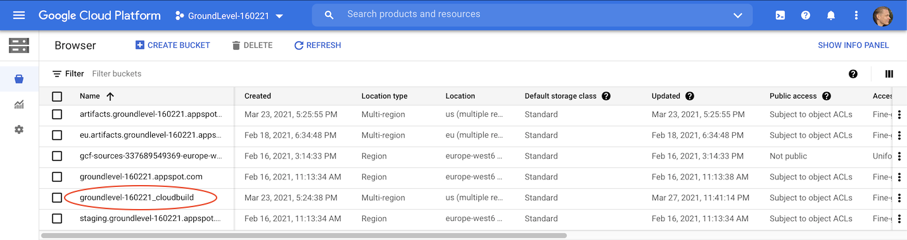

# Developer notes

## `.gcloudignore`

Cloud Build ignores the files in the *root*'s `.gitignore` automatically but:

- it does not check the global `.gitignore`
- it does not check `.gitignore`s in subdirectories
- it makes sense not to send all the version controlled files to Cloud Build (eg. docs, images)

For these reasons, the repo has its own `.gcloudignore`, to keep the transports small.

## See what gets shipped

```
$ gcloud meta list-files-for-upload ..
```

## Semi-cloud builds

This command is a middle ground between the local build and Cloud Build. 

Runs a Cloud Build run, triggered from the command line.

```
$ gcloud builds submit ..
```

Maybe useful.


## Use of Cloud Storage 

Cloud Build uses Cloud Storage (of the same project) to store files. During the development of the repo, the buckets looked like this:

>

The `groundlevel-160221_cloudbuild` is the important one for us.

It has a `source/` folder with `.tgz` packages.

If you have problems, check that the packaging is how you'd imagine it to be.

<!-- tbd. Is there something one should do, to help the cleanup (eg. lifecycle settings for the storage bucket?)

### Maintenance

...
-->

### Build logs

One omission in the above screen capture is build logs.

`gcloud builds submit --help` states that they should be stored (by default) in a bucket:

```
gs://[PROJECT_NUMBER].cloudbuild-logs.googleusercontent.com/
```

>*tbd. Where can I see Cloud Build logs?*


## Troubleshoot manually

To launch a Docker container, similar to what `gcloud builds submit` does:

```
# at project root
$ docker run -it --volume `pwd`:/workspace eu.gcr.io/groundlevel-160221/firebase-custom-builder:latest /bin/bash
bash-5.0#
```

You can now execute the build steps and debug, if something doesn't work right. Faster than changing `cloudbuild.yaml`.

>Note DIFFERENCES: Whereas Cloud Build copies files and **excludes** certain ones, here you see a mapping of the actual disk contents on your host. If you remove something, it's removed in the host.

---

>**Have enough RAM in Docker**
>
>Docker default for the author was 2GB. Things work, but performance is *really* sluggish. (may not be the RAM, though...)

---

## Viewing builds

See -> [Viewing build results](https://cloud.google.com/build/docs/view-build-results) (Cloud Build docs)

>Note: You are able to transport build logs to Cloud Logging. Google has documentation on this; the author hasn't tried it yet. (please do and share the experiences!)

## Kaniko caching

Not for us. It seems a technology worth if one builds Docker containers (this is *not* clearly stated in its documentation, but implied).


## Misc notes

- Timeout for the builds seems to be 10min (600s); seen in `gcloud builds describe <id>`.


## References

- `gcloud topic gcloudignore`
- `gcloud builds submit --help`

