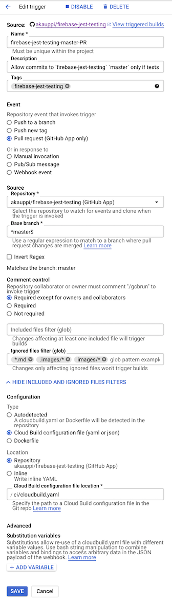
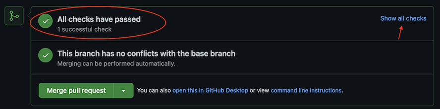
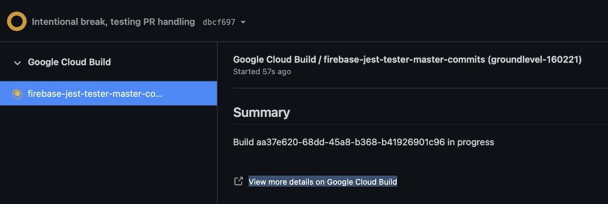
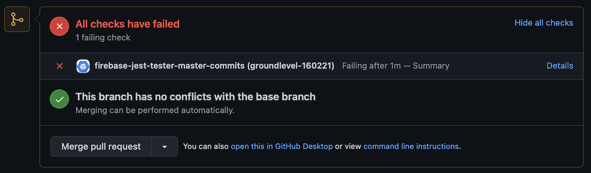
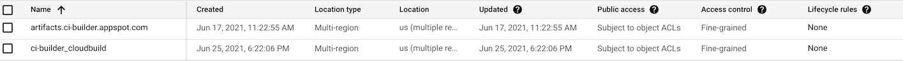

# CI

The repos' CI is set up using Cloud Build. Tests are run for each PR targeting `master` or `next` branches.

The CI is run in a particular GCP project (`ci-builder`) that the author has for this purpose.

>Note: Commands in this document are intended to be executed in the `ci` folder.

## Requirements

- `gcloud` Google Cloud Platform CLI

   <details><summary>Installation on macOS</summary>
   Follow [Installing Google Cloud SDK](https://cloud.google.com/sdk/docs/install)
	
	After unpacking, move the folder to a permament location (author uses `~/bin/google-cloud-sdk`). The installation is on that directory only, and uninstalling means removing the directory.

   ```
   $ gcloud --version
	Google Cloud SDK 343.0.0
	...
   ```

   Update by: `gcloud components update`
	</details>

   <details><summary>Installation on Windows 10 + WSL2</summary>
   tbd.. `#contribute`
   </details>

- Docker

   Needed for building the builders.


### GCP: CI project, Builder image

- [Building the builder](Building%20the%20Builder.md)

You can either finish with this document and check it later, or drop in their right now. Your CI script will eventually need the builder to exist.

### GitHub: Enable App triggers

- In [GitHub Marketplace](https://github.com/marketplace), enable the "Google Cloud Build" application
- Add your GitHub repo to the Cloud Build app


## Building manually

Make sure you are logged into the GCP project used for the Cloud Build.

```
$ gcloud config get-value project
ci-builder
```

```
$ gcloud builds submit ..
```

This packages the files (filtered by `../.gcloudignore`), ships them to Cloud Build, runs the build in the cloud, and streams the output to your terminal.

It's a GREAT way to check builds when developing them. You don't need to commit changes to git until the builds work!

>Side note: 
>There is also a `cloud-build-local` tool that allows to run the whole build, locally. However, it's badly maintained (Jun 2021), slow, and needs restarting Docker every now and then. Avoid it.


<!-- DEPRECATED: `cloud-build-local` is badly maintained, and not available with the way we recommend installing for Windows 10 + WSL2; disabled.

There is a `cloud-build-local` tool that allows one to run Cloud Build scripts, locally. Let's try it!

>Note: The local builder can build on only Linux or macOS.<sub>[source](https://cloud.google.com/build/docs/build-debug-locally#restrictions_and_limitations)</sub>

```
$ gcloud components install cloud-build-local
```

We should now be able to run Cloud Builds locally on the repo.

```
$ cloud-build-local --dryrun=true ..
```

The dry run proves that the build configuration looks solid but does not execute the build steps.

### Real build

```
$ cloud-build-local --dryrun=false ..
```

<details>
<summary>Build output</summary>

```
$ cloud-build-local --dryrun=false ..
2021/03/26 10:03:52 Warning: The server docker version installed (20.10.5) is different from the one used in GCB (19.03.8)
2021/03/26 10:03:52 Warning: The client docker version installed (20.10.5) is different from the one used in GCB (19.03.8)
Using default tag: latest
latest: Pulling from cloud-builders/metadata
Digest: sha256:ac630903464f3fa39c8c1698c9d867dfdbc66d55e09c0518725440af1bf95b18
Status: Image is up to date for gcr.io/cloud-builders/metadata:latest
gcr.io/cloud-builders/metadata:latest
2021/03/26 10:04:35 Started spoofed metadata server
2021/03/26 10:04:35 Build id = localbuild_7b99d6da-d98f-4954-bca4-88f59486a339
2021/03/26 10:04:35 status changed to "BUILD"
BUILD
Starting Step #0
Step #0: Already have image (with digest): eu.gcr.io/groundlevel-160221/firebase-custom-builder
Step #0: /workspace/packages/backend
Finished Step #0
2021/03/26 10:04:36 Step Step #0 finished
Starting Step #1
Step #1: Already have image (with digest): eu.gcr.io/groundlevel-160221/firebase-custom-builder
Step #1: npm WARN deprecated request@2.88.2: request has been deprecated, see https://github.com/request/request/issues/3142
Step #1: npm WARN deprecated har-validator@5.1.5: this library is no longer supported
Step #1: npm WARN deprecated request-promise-native@1.0.9: request-promise-native has been deprecated because it extends the now deprecated request package, see https://github.com/request/request/issues/3142
Step #1: 
Step #1: > core-js@3.6.5 postinstall /workspace/packages/backend/node_modules/core-js
Step #1: > node -e "try{require('./postinstall')}catch(e){}"
Step #1: 
Step #1: Thank you for using core-js ( https://github.com/zloirock/core-js ) for polyfilling JavaScript standard library!
Step #1: 
Step #1: The project needs your help! Please consider supporting of core-js on Open Collective or Patreon: 
Step #1: > https://opencollective.com/core-js 
Step #1: > https://www.patreon.com/zloirock 
Step #1: 
Step #1: Also, the author of core-js ( https://github.com/zloirock ) is looking for a good job -)
Step #1: 
Step #1: 
Step #1: > protobufjs@6.10.2 postinstall /workspace/packages/backend/node_modules/protobufjs
Step #1: > node scripts/postinstall
Step #1: 
Step #1: npm WARN lifecycle @local/back-end@~postinstall: cannot run in wd @local/back-end@ (cd functions && npm install) (wd=/workspace/packages/backend)
Step #1: npm WARN optional SKIPPING OPTIONAL DEPENDENCY: fsevents@^2.2.1 (node_modules/jest-haste-map/node_modules/fsevents):
Step #1: npm WARN notsup SKIPPING OPTIONAL DEPENDENCY: Unsupported platform for fsevents@2.3.2: wanted {"os":"darwin","arch":"any"} (current: {"os":"linux","arch":"x64"})
Step #1: 
Step #1: added 9 packages from 20 contributors, removed 12 packages, updated 613 packages and audited 580 packages in 57.549s
Step #1: 
Step #1: 42 packages are looking for funding
Step #1:   run `npm fund` for details
Step #1: 
Step #1: found 0 vulnerabilities
Step #1: 
Finished Step #1
2021/03/26 10:05:36 Step Step #1 finished
Starting Step #2
Step #2: Already have image (with digest): eu.gcr.io/groundlevel-160221/firebase-custom-builder
Step #2: 
Step #2: > @local/back-end@ test /workspace/packages/backend
Step #2: > npm run ci
Step #2: 
Step #2: 
Step #2: > @local/back-end@ ci /workspace/packages/backend
Step #2: > npm run ci:seq
Step #2: 
Step #2: 
Step #2: > @local/back-end@ ci:seq /workspace/packages/backend
Step #2: > firebase emulators:exec --project=bunny --only firestore,functions "npm run _ci_init && npm run --silent _ci_fns && npm run --silent _ci_rules"
Step #2: 
Step #2: i  emulators: Starting emulators: functions, firestore
Step #2: ⚠  functions: The following emulators are not running, calls to these services from the Functions emulator will affect production: auth, database, hosting, pubsub
Step #2: ⚠  Your requested "node" version "^14 || ^15" doesn't match your global version "14"
Step #2: ⚠  functions: You are not signed in to the Firebase CLI. If you have authorized this machine using gcloud application-default credentials those may be discovered and used to access production services.
Step #2: ⚠  functions: Unable to fetch project Admin SDK configuration, Admin SDK behavior in Cloud Functions emulator may be incorrect.
Step #2: i  firestore: downloading cloud-firestore-emulator-v1.11.12.jar...
Step #2: 
Step #2: i  firestore: Firestore Emulator logging to firestore-debug.log
Step #2: i  functions: Watching "/workspace/packages/backend/functions" for Cloud Functions...
Step #2: ✔  functions[userInfoShadow_2]: firestore function initialized.
Step #2: ✔  functions[logs_1]: http function initialized (http://localhost:5002/bunny/us-central1/logs_1).
Step #2: i  Running script: npm run _ci_init && npm run --silent _ci_fns && npm run --silent _ci_rules
Step #2: 
Step #2: > @local/back-end@ _ci_init /workspace/packages/backend
Step #2: > node test/prime-docs.js
Step #2: 
Step #2: Primed :)
Step #2: (node:124) ExperimentalWarning: VM Modules is an experimental feature. This feature could change at any time
Step #2: (Use `node --trace-warnings ...` to show where the warning was created)
Step #2: PASS test-fns/userInfo.test.js
Step #2:   userInfo shadowing
Step #2:     ✓ Central user information is not distributed to a project where the user is not a member (315 ms)
Step #2:     ○ skipped Central user information is distributed to a project where the user is a member
Step #2: 
Step #2: Test Suites: 1 passed, 1 total
Step #2: Tests:       1 skipped, 1 passed, 2 total
Step #2: Snapshots:   0 total
Step #2: Time:        1.399 s
Step #2: Ran all test suites.
Step #2: i  functions: Beginning execution of "userInfoShadow_2"
Step #2: >  Global userInfo/xyz change detected:  { displayName: 'blah', photoURL: 'https://no-such.png' }
Step #2: >  User 'xyz' not found in any of the projects.
Step #2: i  functions: Finished "userInfoShadow_2" in ~1s
Step #2: (node:172) ExperimentalWarning: VM Modules is an experimental feature. This feature could change at any time
Step #2: (Use `node --trace-warnings ...` to show where the warning was created)
Step #2: Cleared and primed!
Step #2: Docs primed for test-rules.
Step #2: PASS test-rules/projectsC/index.test.js
Step #2:   '/projects' rules
Step #2:     ✓ unauthenticated access should fail (593 ms)
Step #2:     ✓ user who is not part of the project shouldn't be able to read it (175 ms)
Step #2:     ✓ user who is an author or a collaborator can read a project (that is not 'removed') (272 ms)
Step #2:     ✓ user needs to be an author, to read a 'removed' project (46 ms)
Step #2:     ✓ any authenticated user may create a project, but must include themselves as an author (429 ms)
Step #2:     ✓ An author can change '.title' (122 ms)
Step #2:     ✓ An author can not change the creation time (96 ms)
Step #2:     ✓ An author can mark a project '.removed' (94 ms)
Step #2:     ✓ An author can remove the '.removed' mark (109 ms)
Step #2:     ✓ An author can add new authors, and remove authors as long as one remains (313 ms)
Step #2:     ✓ no user should be able to delete a project (only cloud functions or manual) (42 ms)
Step #2: 
Step #2: PASS test-rules/projectsC/symbolsC.test.js
Step #2:   '/projects/.../symbols' rules
Step #2:     ✓ unauthenticated access should fail (131 ms)
Step #2:     ✓ user who is not part of the project shouldn't be able to read (73 ms)
Step #2:     ✓ project members may read all symbols (306 ms)
Step #2:     ✓ all members may create; creator needs to claim the symbol to themselves (391 ms)
Step #2:     ✓ members may claim a non-claimed symbol (269 ms)
Step #2:     ✓ members may do changes to an already claimed (by them) symbol (125 ms)
Step #2:     ✓ claim cannot be changed (e.g. extended) (50 ms)
Step #2:     ✓ members may delete a symbol claimed to themselves (103 ms)
Step #2:     ○ skipped members may revoke a claim
Step #2: 
Step #2: PASS test-rules/invitesC.test.js
Step #2:   '/invites' rules
Step #2:     ✓ no-one should be able to read (254 ms)
Step #2:     ✓ only a member of a project can invite; only author can invite as-author (484 ms)
Step #2:     ✓ validity: server time; identifying oneself; 'email:project' as id (189 ms)
Step #2: 
Step #2: PASS test-rules/userInfoC.test.js
Step #2:   '/userInfo' rules
Step #2:     ✓ no-one should be able to read (169 ms)
Step #2:     ✓ only the user themselves can write the info (443 ms)
Step #2: 
Step #2: PASS test-rules/projectsC/userInfoC.test.js
Step #2:   '/projects/.../userInfo/' rules
Step #2:     ✓ unauthenticated access should fail (115 ms)
Step #2:     ✓ user who is not part of the project shouldn't be able to read (61 ms)
Step #2:     ✓ project members may read all symbols (74 ms)
Step #2:     ✓ all members may create their own entry (133 ms)
Step #2:     ✓ one cannot create an entry for another member (36 ms)
Step #2:     ✓ members may update the 'lastActive' field (of their own doc) (45 ms)
Step #2:     ✓ members may not update the 'lastActive' field of other members (46 ms)
Step #2:     ✓ members may not update fields that Cloud Function updates (42 ms)
Step #2:     ✓ members may not delete their document (47 ms)
Step #2: 
Step #2: Test Suites: 5 passed, 5 total
Step #2: Tests:       1 skipped, 33 passed, 34 total
Step #2: Snapshots:   0 total
Step #2: Time:        7.951 s
Step #2: Ran all test suites.
Step #2: ✔  Script exited successfully (code 0)
Step #2: i  emulators: Shutting down emulators.
Step #2: i  functions: Stopping Functions Emulator
Step #2: i  firestore: Stopping Firestore Emulator
Step #2: i  hub: Stopping emulator hub
Finished Step #2
2021/03/26 10:06:11 Step Step #2 finished
Starting Step #3
...
```
</details>


**Troubleshooting**

Check the Issues if you have problems with the tool. Especially [Gets stuck during build](https://github.com/GoogleCloudPlatform/cloud-build-local/issues/79).
-->


## Setting up Triggers

We wish the CI to run tests when:

- a new PR (or a change to an existing PR), targeting `master` (or `next`) is available.
  
  This will help us see, whether merging the changes is relatively safe.

Deployment of versions to `npm` is left to be done manually.

### Trigger for PRs

Cloud Build > `Triggers` > `Create Trigger`

Something like this:

>

Note: The above is just a sample. Study each choice in turn, and make your own decisions.

We can test this trigger only by making a PR. 

#### Testing the trigger

Let's make a Pull Request and see how it shows in GitHub.

```
$ git checkout -b temp-230521

# edit some change; eg. add white space to non-document file

$ git commit -m "testing CI"

$ git push --set-upstream origin temp-230521
```

Go to [GitHub](https://github.com/akauppi/firebase-jest-testing).

Create a pull request with the button there, mentioning the recent push.



Make a breaking change that would cause a test to fail.

```
$ git commit -m "break test"
$ git push
```

The GitHub PR page should show this:



...turning into this:



Note that the "Merge pull request" button is still available, though not highlighted.


## Use of Cloud Storage (extra)

Cloud Build uses Cloud Storage (of the same project) to store files. The buckets look like this:

>

|bucket|file sizes|purpose|
|---|---|---|
|`artifacts.*/containers/images`|1..25 MB|(unknown)|
|`*_cloudbuild/source/*.tgz`|~33 kB|source tarballs|

The storage requirements are minimal, but by default there's no lifecycle rule for these files, meaning they will be kept "forever".

>Here is one benefit of keeping one's CI's running on a separate GCP project - all the storage buckets we see here are connected to CI/CD runs (and therefore easier to clean).

Either:

- forget about this :)
- visit it once a year, and remove the buckets totally
- add lifecycle rules that remove aged stuff

CI/CD older than a month are likely not ever needed (= 30 days and delete would be fine).


## References

- [Cloud Build](https://cloud.google.com/build/) (GCP)
- [Creating GitHub App triggers](https://cloud.google.com/build/docs/automating-builds/create-github-app-triggers) (Cloud Build docs)
- [Building and debugging locally](https://cloud.google.com/build/docs/build-debug-locally) (Cloud Build docs)
- [Building Node.js applications](https://cloud.google.com/build/docs/building/build-nodejs) (Cloud Build docs)
- `gcloud builds submit --help`

